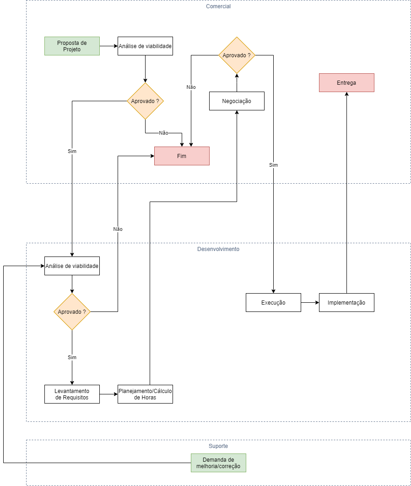

# Engenharia de Software 
## Processo de Desenvolvimento de Software 

### Visão Geral

Este documento visa registrar e elucidar as etapas que compõem o nosso processo para desenvolvimento de projetos.

### Objetivos

1. Padronização;
1. Aumento na produtividade;
1. Organização de processo;

### Especificações

Para exemplificar o processo desenvolvido, fizemos uso da montagem em diagramas. Cada etapa é representada por um elemento presente no diagrama com as equipes Comercial e Desenvolvimento englobando àquelas pelas quais são responsáveis.

É importante evidenciar que as etapas em verde indicam o início do processo enquanto as etapas em vermelho indicam o final, seja ele a entrega do projeto ou sua não execução. 

### Etapas

* **Proposta de Projeto**

Representando o início do processo, a proposta de projeto será realizada pelo cliente e recebida pela equipe Comercial. Ela deverá conter requisição do cliente e é responsabilidade da equipe em questão obter o máximo de detalhes possíveis da mesma.

* **Análise de Viabilidade Comercial**

Nesse momento, a equipe Comercial, levando em consideração os aspectos de análise pré-estabelecidos, deverá avaliar se a proposta em questão é viável para a empresa. Caso seja aprovada, ela será encaminhada para o time de Desenvolvimento.

* **Análise de Viabilidade Desenvolvimento**

Nesta etapa, cabe ao time de Desenvolvimento a avaliação da proposta já aprovada pela equipe Comercial. Novamente, essa análise levará em conta os critérios de aprovação pré-estabelecidos e, caso aprovada, seguirá para o levantamento de requisitos. 

* **Levantamento de Requisitos e Planejamento de Horas**

Para o levantamento de requisitos, encaminharemos a proposta de projeto para o Product Owner, ele será o responsável por fazer o primeiro “backlog do produto” levantando em consideração os recursos e requisitos necessários para sua execução. Cabe a ele, juntamente com o time de desenvolvimento estipular um prazo para a entrega do projeto, baseado em todos os requisitos levantados no backlog. 

* **Negociação**

Finalizados o desenvolvimento do backlog do produto e o planejamento de horas, a equipe Comercial será responsável por aprovar juntamente com o Cliente os valores para execução do projeto, assim como o prazo pré-estabelecido. Se esses aspectos forem aprovados pelo cliente, daremos andamento à execução do projeto.

* **Execução**

Esta etapa tem como objetivo o desenvolvimento do projeto. Usando a metodologia ágil Scrum, primeiramente o Product Owner juntamente com o time de Desenvolvimento serão responsáveis pelo planejamento da sprint, definindo as entregas que serão feitas na mesma (incremento). 

Após essa reunião, a sprint será iniciada e a equipe trabalhará em conjunto para concluir o incremento. Durante a sprint, o time realizará reuniões diárias para verificação do andamento do projeto (“O que eu fiz ontem?”, “O que planejo fazer hoje?”, “Há algum obstáculo?”).

Terminada a sprint, a equipe novamente se reúne para verificar quais itens do backlog foram concluídos, como a ideia das sprints é entregar sempre um micro-serviço funcional, é também o momento de testes e aprovação do incremento. Também, é realizada uma retrospectiva da sprint, para a equipe documentar/discutir os aspectos que funcionaram ou não durante a mesma. 

É importante lembrar que a metodologia Scrum funciona como um ciclo e que as etapas explicadas anteriormente se repetem até a conclusão do projeto. Ainda, caso seja necessário, os aspectos discutidos durante a análise de sprint podem ser transmitidos ao Cliente.

* **Implementação**

Esse momento será reservado para a implementação do produto já finalizado, fará parte da implementação a criação de uma manual de uso para o Cliente, buscando facilitar o treinamento da equipe do mesmo para o uso da ferramenta.

* **Entrega**

Por fim, o produto 100% funcional e o manual de uso são entregues para o Cliente.

* **Demanda de melhoria/correção**

Após a entrega do projeto, é possível o surgimento de demandas de melhorias ou correções por parte do Cliente, assim, a equipe de Suporte será responsável por receber essas demandas e encaminhá-las ao Product Owner, iniciando um novo ciclo de análise de viabilidade.

### Conclusão

Finalmente, é importante ressaltar que as etapas elucidadas tem o propósito de otimizar a construção de projetos e coordenar o funcionamento das equipes. 
Um vídeo explicativo de todo o processo pode ser encontrado [aqui](https://drive.google.com/file/d/1mrrXzd8FSryEhdMYyPsPJHv7nvkBczXd/view?usp=sharing)
